# Tutorials
This web development project was requested by my friend Ethan Southard in exchange for pay. It is a chance for me to grow as a software developer and learn new technologies and to expand my technology stack. In 2026, the most popular technology stack is Next.js, Node.js, Express.js, and PostgreSQL. Therefore this project will be using those tools.

## What is the Tutorials Folder For?
The `📁 tutorials` folder is for me to practice certain skills in preparation for creating this web application for Ethan.

## An Understanding of Modern Web Development Tools:
This technology stack is very similar to the MERN stack and it's helpful for us to have an analogy of what is going on here and why we need all of these different technologies. But before we do, we have to have an understanding of modules, libraries, and frameworks.


### Understanding Terminologies
In today's programming landscape, sometimes people use the words "modules", "packages", "libraries" and "frameworks" loosely without a rigorous definition for what they are. The following table will help us simplify the difference between the terms. Imagine we are dealing with Legos. We first deal with the terminologies of "packages" and "modules" which deal with distribution and loading, and then we talk about "libraries" and "frameworks" which deal with flow and control (we are strictly talking in the Javascript world):

| Term | Lego Analogy | What it Means | Examples | Source |
|---|---|---|---|---|
| Package | A LEGO® box that you buy from a store. It has a label (package.json) that references what is inside of it. The box of legos is how it gets delivered to you. | A file or directory described by a `package.json` file. This package can contain many modules, but does not necessarily have to (e.g. CLI tools). | `react`, `loadash`, `express`, `d3` (you can install these via node package manager) | [NPM Docs](https://docs.npmjs.com/about-packages-and-modules): A package is a file or directory that is described by a package.json file. A package must contain a package.json file in order to be published to the npm registry. |
| Module | An individual LEGO® brick or a pre-connected set of bricks that snaps into your build. It's the actual piece you use. Sometimes it can come with instructions. | Anything that can be loaded by `require()` or `import` statements. | This is an example `import React from 'react';` — here `react` is used as a module. | [NPM Docs](https://docs.npmjs.com/about-packages-and-modules): A module is any file or directory in the node_modules directory that can be loaded by the `Node.js` `require()` or `import` syntax. (This is a bit restrictive as modules don't necessarily have to be in the `node_modules` folder. You can create a local file outside `node_modules` and import it as a module into another file.) |

As we see above, something can be both a package and a module at the same time. For example, `react` is a package (it is distributed as a packaged), but it's consumed as a module (using `import` or `require()` statements). As we can see, "packages" and "modules" deal with loading and distributing.

| Term | Lego Analogy | What it Means | Examples | Source |
|---|---|---|---|---|
| Library | This is a box of LEGO® bricks without any particular instructions. You can decide how you want to use it and include it in your project. | A collection of pre-written code that **you** call when you need it. | `react`, `lodash`, `jQuery`, `D3.js` | This is popularized by Martin Fowler's *Inversion of Control* concept in 2004. |
| Framework |  This is a box of LEGO® bricks **with** instructions. It might say something like put your peice here on line 47. The set dictates the structure. | A structured environment that calls your code at predetermined points. The framework controls the application flow. | `Next.js`, `Angular`, `Express`, `Django` | This is popularized by Martin Fowler's *Inversion of Control* concept in 2004. |

As we can see above, a "libraries" and "frameworks" have to deal with how the flow and control of the application works. With libraries, you can call them whenever you want. With frameworks, there is an expected way to fill in the blank. It's expecting something from you.

*Note, sometimes a package doesn't have import statements, but installs other packages (sub-packages). The reason for this is because we don't necessarily one a huge/giant file all the time. Here are two examples:

* This one deals with the [d3.js library](https://d3js.org/) which is helpful is making iteractive data visuals like charts and graphs:
```
d3 (PACKAGE)
├── package.json (lists dependencies)
│
├── depends on → d3-selection (SUB-PACKAGE, has its own package.json)
├── depends on → d3-scale (SUB-PACKAGE, has its own package.json)
├── depends on → d3-array (SUB-PACKAGE, has its own package.json)
├── depends on → d3-axis (SUB-PACKAGE, has its own package.json)
└── ... 30+ more sub-packages
```
* This one deals with the frontend UI/UX framework called [Angular 2](https://angular.dev/):
```
@angular/core    (PACKAGE) ← Always needed
@angular/common  (PACKAGE) ← Common directives like ngIf, ngFor
@angular/router  (PACKAGE) ← Only if you need routing
@angular/forms   (PACKAGE) ← Only if you need forms
@angular/http    (PACKAGE) ← Only if you need HTTP calls
```

⚠️ Also note: Sometimes there are technologies like Vue.js that can operate as both a library and a framework. You can build full SPA applications with Vue.js (it calls your lifecycle hooks (`mounted`, `created`, etc.), you don't call it). You can also use it as a library though. See more examples below:

* `Vue.js` As a Framework:
```javascript
// main.js - Vue takes over
import { createApp } from 'vue'
import App from './App.vue'
import router from './router'
import store from './store'

createApp(App)
  .use(router)  // Vue controls routing
  .use(store)   // Vue controls state
  .mount('#app')  // Vue owns the entire page
```

* `Vue.js` as a Library:
```html
<!-- Existing page, not built with Vue -->
<html>
<head>
  <title>My Existing Website</title>
</head>
<body>
  <header>Regular HTML header</header>
  
  <main>
    <p>Regular HTML content...</p>
    
    <!-- Just THIS part uses Vue -->
    <div id="feedback-widget"></div>
    
    <p>More regular HTML...</p>
  </main>

  <script src="https://unpkg.com/vue@3/dist/vue.global.js"></script>
  <script>
    // You decide when and where to use Vue
    const { createApp, ref } = Vue
    
    createApp({
      setup() {
        const rating = ref(0)
        const submitted = ref(false)
        
        const submit = () => {
          fetch('/api/feedback', {
            method: 'POST',
            body: JSON.stringify({ rating: rating.value })
          })
          submitted.value = true
        }
        
        return { rating, submitted, submit }
      },
      template: `
        <div v-if="!submitted">
          <p>Rate your experience:</p>
          <button v-for="n in 5" @click="rating = n">
            {{ n <= rating ? '★' : '☆' }}
          </button>
          <button @click="submit">Submit</button>
        </div>
        <div v-else>Thanks for your feedback!</div>
      `
    }).mount('#feedback-widget')
  </script>
</body>
</html>
```

#### How Do They All Relate?


### Javascript History, Runtime Environments, and Serverside Languages
Traditionally speaking, Javascript could have only ran on the browser (via Google's V8 engine or Netscape's SpiderMonkey). However, what `Node.js` allows us to do is to run Javascript **outside** the browser. `Node.js` is a runtime environment (meaning that it can run Javascript **outside** the browser). This is important, because without a runtime environment like .NET Runtime (C#), `Node.js`/`Bun.js`/`Deno.js` (JS), Ruby Runtime (Ruby), or Python Runtime (Python), the browser **cannot** connect to a database. Databases have existed for a very long time and code could still connect to it, but they were often local code and not things from the browser.

Sometimes people interchangeably use *runtime environment* with *server-side language*. But that is not to be confused. For example, people often call `Node.js` a server-side language. This is wrong. Javascript is the server-side language (the language running on the server) and `Node.js` is the runtime (it uses Javascript).

For development purposes, this basically means that our local computer acts as the server. However, when we publish this on the web, we can use an actual server like [Hostinger](https://www.hostinger.com/) or [Vercel](https://vercel.com/). For example, using `Node.js`, we can read files on our computer or delete files from our computer when building the application locally. However, when we publish it to something like [Vercel](https://vercel.com/), `Node.js` would read files and delete files from the server.

### How do HTTP Requests Work and Why Do We Need Express.js?
The way web browsers work is that when a user types in a URL, the browser sends some information to a server using transmission control protocol (TCP). When TCP is structured like with a method (`GET`, `POST`), a path (`/api/users`), a body, etc.. then it's HTTP.

Here is an example of HTTP request:
```
GET /api/users HTTP/1.1
Host: example.com
Content-Type: application/json
Authorization: Bearer abc123

{"name": "Alice"}
```
The server will recieve this HTTP request in raw bytes, but something needs to be able to parse the bytes. Here, we have something like the `http` module in `Node.js` to do this low level work:
```javascript
const http = require('http');

const server = http.createServer((req, res) => {
  // Node.js has already parsed the raw HTTP text into:
  console.log(req.method);   // "GET"
  console.log(req.url);      // "/api/users"
  console.log(req.headers);  // { host: "example.com", ... }
  
  // But the body is NOT parsed. It comes as a stream of chunks:
  req.on('data', (chunk) => {
    console.log(chunk); // raw bytes/buffer
  });
  
  req.on('end', () => {
    // request fully received
  });

  // To respond, you write raw HTTP back:
  res.statusCode = 200;
  res.setHeader('Content-Type', 'text/plain');
  res.end('Hello World');
});

server.listen(3000);
```
What this is doing is passing the `req` object (which has it's own properties and methods) and the `res` object into the `http.createServer()` function. 

#### Why TCP Connection Instead of UDP?
UDP has it's purposes, however for modern webpages TCP makes the best sense. We need a connection type that guarantees every package is awknowledge. If a packet is lost, you want it retransmitted so that there is no partial HTML missing from a page. And you also want the packets to arrive in the right order. Here is a schematic explaining this:

```mermaid
%%{init: {'flowchart': {'nodeSpacing': 15, 'rankSpacing': 50}}}%%
flowchart LR
    subgraph TCP_SECTION[" "]
        direction LR
        TCP_TITLE(["📦 TCP"])
        P1["Here's packet 1"]
        A1["Got it"]
        P2["Here's packet 2"]
        A2["Got it"]
        ETC["..."]
        
        TCP_TITLE ~~~ P1 --> A1 --> P2 --> A2 --> ETC
    end
    
    subgraph UDP_SECTION[" "]
        direction LR
        UDP_TITLE(["⚡ UDP"])
        BLAST["Here's packet 1, 2, 3, 4, 5"]
        HOPE["(hope for the best)"]
        
        UDP_TITLE ~~~ BLAST --> HOPE
    end
    
    TCP_SECTION ~~~ UDP_SECTION

    %% === SUBGRAPH STYLING ===
    style TCP_SECTION fill:#0f172a,stroke:#22c55e,stroke-width:3px,rx:15,ry:15
    style UDP_SECTION fill:#0f172a,stroke:#f97316,stroke-width:3px,rx:15,ry:15
    
    %% === TITLE STYLING (pill shaped) ===
    style TCP_TITLE fill:#22c55e,stroke:#22c55e,stroke-width:2px,color:#fff,font-weight:bold
    style UDP_TITLE fill:#f97316,stroke:#f97316,stroke-width:2px,color:#fff,font-weight:bold
    
    %% === TCP NODE STYLING ===
    style P1 fill:#052e16,stroke:#15803d,color:#bbf7d0,rx:8,ry:8
    style A1 fill:#1e293b,stroke:#475569,color:#94a3b8,rx:8,ry:8
    style P2 fill:#052e16,stroke:#15803d,color:#bbf7d0,rx:8,ry:8
    style A2 fill:#1e293b,stroke:#475569,color:#94a3b8,rx:8,ry:8
    style ETC fill:#1e293b,stroke:#475569,color:#94a3b8,rx:8,ry:8
    
    %% === UDP NODE STYLING ===
    style BLAST fill:#431407,stroke:#c2410c,color:#fed7aa,rx:8,ry:8
    style HOPE fill:#1e293b,stroke:#475569,color:#94a3b8,rx:8,ry:8,font-style:italic
    
    %% === LINK STYLING ===
    linkStyle default stroke:#475569,stroke-width:2px
```


However, there are some things UDP excels at: video games, streaming videos, VoIP...
⚠️ Also note: As of 2026, modern HTTP/3 uses a combination of UDP and TCP called QUIC.

### A Kitchen Analogy for Web Development
Our web application is like a kitchen. 

#### How Does our Web Application All Relate?

```mermaid
%%{init: {'flowchart': {'nodeSpacing': 20, 'rankSpacing': 40}}}%%
flowchart TB
    subgraph SERVER[" "]
        direction TB
        S_TITLE(["🖥️ YOUR COMPUTER / SERVER"])
        
        subgraph NODEJS[" "]
            direction TB
            N_TITLE(["⚡ Node.js"])
            N_DESC["(The Runtime Environment)"]

            subgraph EXPRESS[" "]
                direction TB
                E_TITLE(["🚀 Express.js"])
                E_DESC["(Your Server Code)"]
                E_DETAIL["Listens for requests, talks to PostgreSQL, sends responses back"]
                
                E_TITLE --- E_DESC --- E_DETAIL
            end
            
            N_TITLE --- N_DESC
            N_DESC --- EXPRESS
        end
        
        subgraph POSTGRES[" "]
            direction TB
            P_TITLE(["🗄️ PostgreSQL"])
            P_DESC["(Database)"]
            P_DETAIL["Stores all your data in tables"]
            
            P_TITLE --- P_DESC --- P_DETAIL
        end
        
        S_TITLE --- N_TITLE
        EXPRESS <--> POSTGRES
    end
    
    INTERNET(["🌐 Internet"])
    
    subgraph BROWSER[" "]
        direction TB
        B_TITLE(["👤 USER'S BROWSER"])
        B_DETAIL["Makes fetch requests, displays the website"]
        
        B_TITLE --- B_DETAIL
    end
    
    SERVER <--> INTERNET <--> BROWSER

  %% === LINK INDEX REFERENCE ===
  %% 0: E_TITLE --- E_DESC (hide)
  %% 1: E_DESC --- E_DETAIL (hide)
  %% 2: N_TITLE --- N_DESC (hide)
  %% 3: N_DESC --- EXPRESS (hide)
  %% 4: P_TITLE --- P_DESC (hide)
  %% 5: P_DESC --- P_DETAIL (hide)
  %% 6: S_TITLE --- NODEJS (hide)
  %% 7: EXPRESS <--> POSTGRES (SHOW)
  %% 8: B_TITLE --- B_DETAIL (hide)
  %% 9: SERVER <--> INTERNET (SHOW)
  %% 10: INTERNET <--> BROWSER (SHOW)

  %% === HIDDEN LINKS ===
  linkStyle 0 stroke:none
  linkStyle 1 stroke:none
  linkStyle 2 stroke:none
  linkStyle 3 stroke:none
  linkStyle 4 stroke:none
  linkStyle 5 stroke:none
  linkStyle 6 stroke:none
  linkStyle 8 stroke:none
  
  %% === VISIBLE LINKS ===
  linkStyle 7 stroke:#475569,stroke-width:2px
  linkStyle 9 stroke:#475569,stroke-width:2px
  linkStyle 10 stroke:#475569,stroke-width:2px

  %% === SUBGRAPH STYLING ===
  style SERVER fill:#0a0f1a,stroke:#06b6d4,stroke-width:3px,rx:20,ry:20
  style NODEJS fill:#0f172a,stroke:#3b82f6,stroke-width:3px,rx:15,ry:15
  style EXPRESS fill:#1e293b,stroke:#a855f7,stroke-width:3px,rx:12,ry:12
  style POSTGRES fill:#0f172a,stroke:#22c55e,stroke-width:3px,rx:15,ry:15
  style BROWSER fill:#0f172a,stroke:#f43f5e,stroke-width:3px,rx:15,ry:15
  
  %% === TITLE STYLING (pill shaped) ===
  style S_TITLE fill:#06b6d4,stroke:#06b6d4,stroke-width:2px,color:#fff,font-weight:bold
  style N_TITLE fill:#3b82f6,stroke:#3b82f6,stroke-width:2px,color:#fff,font-weight:bold
  style E_TITLE fill:#a855f7,stroke:#a855f7,stroke-width:2px,color:#fff,font-weight:bold
  style P_TITLE fill:#22c55e,stroke:#22c55e,stroke-width:2px,color:#fff,font-weight:bold
  style B_TITLE fill:#f43f5e,stroke:#f43f5e,stroke-width:2px,color:#fff,font-weight:bold
  style INTERNET fill:#f97316,stroke:#f97316,stroke-width:2px,color:#fff,font-weight:bold
  
  %% === DESCRIPTION STYLING (subtitles) ===
  style N_DESC fill:#1e293b,stroke:#475569,color:#94a3b8,rx:8,ry:8
  style E_DESC fill:#2e1065,stroke:#6b21a8,color:#c4b5fd,rx:8,ry:8
  style P_DESC fill:#14532d,stroke:#166534,color:#86efac,rx:8,ry:8
  
  %% === DETAIL STYLING ===
  style E_DETAIL fill:#1e1b4b,stroke:#4c1d95,color:#ddd6fe,rx:8,ry:8
  style P_DETAIL fill:#052e16,stroke:#15803d,color:#bbf7d0,rx:8,ry:8
  style B_DETAIL fill:#4c0519,stroke:#be123c,color:#fecdd3,rx:8,ry:8

  %%{init: {'flowchart': {'nodeSpacing': 65, 'rankSpacing': 15}}}%%
```
